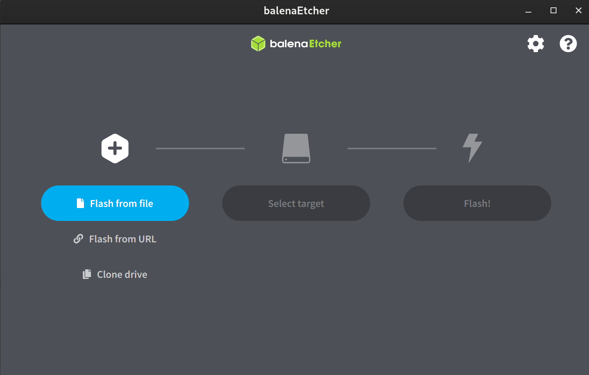

## 前言
本來有寫這個博客的想法，但無奈最近時間比較忙 
> 一心想去編譯Samsung內核，中間一波多折.

故一拖再拖。幸好最近內核的進程一直擱置，我就打算今晚扔到Stackoverflow然後收穫一堆downvote，或者去XDA看看。

## 材料準備
電腦，U盤各一個，在[ArchLinux官方](https://archlinux.org/download/)選擇鏡像站下載鏡像，用[Etcher](https://etcher.balena.io/)製作啓動U盤
>- Etcher 有個非常好的優點——全平臺兼容，醬紫就不怕出現在Linux很難製作Windows啓動U盤的尷尬場面。

___
## 安裝步驟
### 製作啓動盤
打開Etcher 直接選擇iso文件再選擇U盤安裝即可

### 進入BIOS
每個主板或筆電進入BIOS的方法,各不相同故請自行Google
記得在BIOS裏面關閉secure boot
###  連接網路
#### 有線網路

 接上網路，稍等片刻即可

####  無線網路    
    iwctl #進入無線網路工具         
    device list # 列出網路設備 通常爲Wlan0
    station wlan0 scan #掃描無線網路
    station wlan0 get-networks #列出可用無線網路
    station wlan0 connnect WiFiname
>- WiFiname 爲WiFi 名稱，輸入一部分可用Tab補全，然後輸入密碼回車，最後輸入exit退出

###  測試網路連接是否正常
    ping www.bing.com

###  設定鏡像網站
把我们要设定的镜像站放在前面
>- 使用上下左右鍵移動，按i輸入文字，改好後按Esc，再輸入「:wq」退出VIM
>- 如果真的不會如何使用vim那就Google一下再回來吧

    vim /etc/pacman.d/mirrorlist #打開文件按需求把下面的源加進去
中國大陸用戶設定清華源和中科大即可

    #China 
    Server = https://mirrors.tuna.tsinghua.edu.cn/archlinux/$repo/os/$arch
    Server = https://mirrors.ustc.edu.cn/archlinux/$repo/os/$arch

臺灣用戶的可用使用

    Server = https://mirror.archlinux.tw/ArchLinux/$repo/os/$arch

###  分割磁盤
archlinux安裝需要分三個分區

efi分區 512MB.

swap分區 運存的60%

主分區 剩餘部分即爲主分區 .

下面將會把磁盤轉化爲gpt格式，固態硬盤一般爲nvme0n1，我們是直接但系統故直接裝在固態硬盤

    lsblk #顯示分區情況
    parted /dev/nvme0n1
    (parted)mktable            #輸入mktable
    New disk label type? gpt   #輸入gpt 輸入yes即可
    quit                       #退出

下面將會用cfdisk分割磁盤，efi分區格式type爲 EFI Ssystem，Swap分區爲Swap System，主分區爲Lnux System
    
    cfdisk /dev/nvme0n1 #執行分割分區大小，類型
    fdisk -l 

#####  配置分區
    mkfs.vfat /dev/nvmexn1p1 #格式化EFI分區
    mkfs.ext4 /dev/nvmexn1p3 # 格式化主分區爲ext4
    
    mount /dev/nvmexn1p3 /mnt #掛載主分區到/mnt
    mkdir -p /mnt/boot/efi 
    mount /dev/nvmexn1p1 /mnt/boot/efi #掛載efi分區

    mkswap /dev/nvmexn1p2 
    swappon /dev/nvmexn1p2 #設定Swao分區
    fdisk -l #查看分區掛載是否正確

###  用pacstrap安裝基本Linux檔案系統base、核心linux
    pacstrap /mnt linux linux-firmware linux-headers base base-devel
####  生成fstab
    genfstab -U /mnt >> /mnt/etc/fstab
####  檢視掛載狀況
    cat /mnt/etc/fstab
####   chroot到系統。
    arch-chroot /mnt

###  設定主機名和時區
#### 首先在/etc/hostname設定主機名字
    vim /etc/hostname #輸入ArchLinux 再：wq保存退出即可
ArchLinux 爲主機名
####   在vim /etc/hosts配置hosts
    127.0.0.1   localhost
    ::1         localhost
    127.0.1.1   ArchLinux.localdomain ArchLinux

####  設定時區
    ln -sf /usr/share/zoneinfo/Asia/Taipei /etc/localtime # 設定臺北爲時間同步時區 二選一
    ln -sf /usr/share/zoneinfo/Asia/Shanghai /etc/localtime # 設定上海爲時間同步時區 

####  硬體時間
用命令將同步時間設定到硬體

    hwclock --systohc

###   安裝微碼
    pacman -S intel-ucode # Intel
    pacman -S amd-ucode # AMD

###  設定locale
編輯 /etc/locale.gen，去掉 en_US.UTF-8 UTF-8 以及 zh_CN.UTF-8 UTF-8 tw_CN.UTF-8 UTF-8
     
     vim /etc/locale.gen
    locale-gen 

在 /etc/locale.conf 設定爲英文，防止亂碼

    echo 'LANG=en_US.UTF-8'  > /etc/locale.conf

###  安装桌面程式
#### 安装基本软体
    pacman -S sudo networkmanager vim firefox noto-fonts-cjk noto-fonts-emoji
    pacman -S xorg xorg-server pipewire intel-ucode nvtop
    pacman -S fcitx5-im fcitx5-chewing fcitx5-qt fcitx5-gtk fcitx5-chinese-addons
    pacman -S git openssh fakeroot base-devel
###  安装gnome 桌面
    pacman -S gnome gdm 
#### 安装KDE桌面     
    pacman -S sddm plasma-meta kde-applications plasma-wayland-session
>- sddm 为kde桌面的登錄管理器，而gdm为gnome的，
两个桌面二選一即可

僅適用於我的華碩vivobook筆電的聲卡軟體
>>- 如果聲卡不行，可以去arch.wiki查詢

    sudo pacman -S sof-firmware
    sudo pacman -S alsa-ucm-conf

#### 配置中文輸入法
    sudo vim /etc/environment
把下面這幾行加入即可
    GTK_IM_MODULE=fcitx
    QT_IM_MODULE=fcitx
    XMODIFIERS=@im=fcitx
    SDL_IM_MODULE=fcitx
    GLFW_IM_MODULE=ibus

### 爲Root用戶設定密碼
    passwd root
#### 配置Root用戶默認編輯器
>- 在git 和visudo archlinux會使用vi而不是vim，有時候會出錯，所以需要設置默認編輯器
    
    vim ~/.bash_profile
    export EDITOR='vim'
#### 創建普通用戶
>- username 爲用戶名，可自行改成自己的名字如 black
    useradd -m -G wheel -s /bin/bash username
    passwd user # 設定普通用戶密碼
#### 給予普通用戶sudo權限
    EDITOR=vim visudo # 設定visudo的編輯器爲vim,上面的配置尚未生效
>- 找到這行#%wheel ALL=(ALL:ALL) ALL，並把前面的註釋符 # 去掉

### 設定開機服務
    systemctl enable sddm.service #kde桌面需要
    systemctl enable gdm.service #gnome桌面需要
    systemctl enable NetworkManager.service #網路管理員，會自動處理網路連線變更
    systemctl enable sshd.service #ssh服務
    sudo systemctl enable --now bluetooth 啓用藍牙服務(若有)
___
### 安裝引導程式 
####  安裝對應的軟體
    pacman -S grub efibootmgr

###  安装grub 到EFI分区
    grub-install --target=x86_64-efi --efi-directory=/boot --bootloader-id=ARCH
### 生成grub所需文件
    grub-mkconfig -o /boot/grub/grub.cfg

### 系統安裝完成。退出chroot，取消掛載，重啓
    exit
    umount /mnt
    reboot 重啓 
_____
## 系統後續安裝優化

### Clash for windows 代理軟體
開啓[Clash for windows GitHub倉庫](https://github.com/Fndroid/clash_for_windows_pkg)，下載含linux字符文件並解壓運行cfw即可，如有不明之處可查看[官網](https://clashforwindows.org/)

### pacman套件管理員使用方式
pacman 相當於ubuntu 的apt-get,此節列出Arch Linux的套件管理員pacman的常用指令。 
搜索線上倉庫軟體
    
    sudo pacman -Ss <套件名稱>

用此指令安裝套件

    sudo pacman -S <套件名稱>

移除套件

    sudo pacman -R <套件名稱>

以下指令會更新整個系統的套件。因為Arch Linux是滾動發行版，建議每半個月進行一次全系統更新。更新前建議看ArchLinux的新聞有無嚴重bug再更新。

    sudo pacman -Syu
    
強制同步套件庫。某個套件無法下載的時候才執行此指令。

    sudo pacman -Syu

刪除本機套件快取
    sudo pacman -Sc

查看本地已安裝套件
    
    sudo pacman -Qt
> 可用來移除桌面冗餘的套件

### 安裝AUR套件管理員
AUR (Arch User Repository) 是Arch Linux官方套件庫以外的主要套件來源。AUR沒有收錄套件檔案，只有編譯套件的設定檔。AUR套件最直接的裝法是手動git clone儲存庫，然後檢查依賴項目，再用makepkg指令打包安裝。

但是這樣太麻煩了，所以我們通常會安裝一個AUR Helper來自動化處理，我使用yay，語法跟pacman很像
    
    sudo pacman -S --needed git base-devel
    git clone https://aur.archlinux.org/yay.git
    cd yay
    makepkg -si

yay 安裝套件

    yay -S google-chrome # 按下Enter同意安裝，並按照螢幕提示輸入密碼

yay 移除套件
    
    yay -R google-chrome

更新所有AUR套件，並順便更新整個系統的套件：

    yay -Syu

## 自用gnome 插件
先安裝gnome-browser-connector

    yay -S gnome-browser-connector

### [blur-my-shell](https://extensions.gnome.org/extension/3193/blur-my-shell/) 模糊抽屜界面不再是灰色

### [Caffeine ](https://extensions.gnome.org/extension/517/caffeine/) 禁用熒幕保護和自動暫停

### [Clipboard Indicator](https://extensions.gnome.org/extension/779/clipboard-indicator/) 剪貼板管理器，記錄你複製過的內容

### [Coverflow Alt-Tab](https://extensions.gnome.org/extension/307/dash-to-dock/) 此插件可以實現Mac系統的快速切換任務且自帶流暢切換動畫

[Dash to Dock](https://extensions.gnome.org/extension/307/dash-to-dock/) 固定Dock欄，gnome在某次更新砍了這個功能

[Extension List](https://extensions.gnome.org/extension/3088/extension-list/) 在狀態欄開啓插件清單

[OpenWeather ](https://extensions.gnome.org/extension/750/openweather/) 在頂欄顯示天氣狀況

[Vitals ](https://extensions.gnome.org/extension/1460/vitals/) 一個很好用的插件可快速查看系統的CPU，Ram，存儲佔用狀況

### Android 刷機工具
    sudo pacman -S android-tools

## 配置Android Rom 編譯環境
這裏不得不說一下，Archlinux的優點Aur,得益於Aur,安裝編譯Android Rom 的套件僅需開啓32位庫
### 開啓32位庫支援
    vim /etc/pacman.conf

僅需把下面兩行前面的#去掉,輸入：wq保持並推出即可
    
    #[community]
    #Include = /etc/pacman.d/mirrorlist

    sudo pacman -Syyu #更新套件

### 安裝所需套件
    yay -S lineageos-devel android-devel

____
## 文章引用
>- ### [Arch Linux安裝教學，KDE Plasma桌面＋中文輸入法](https://ivonblog.com/posts/install-archlinux/)
>- ### [archlinux 基础安装](https://arch.icekylin.online/guide/)

