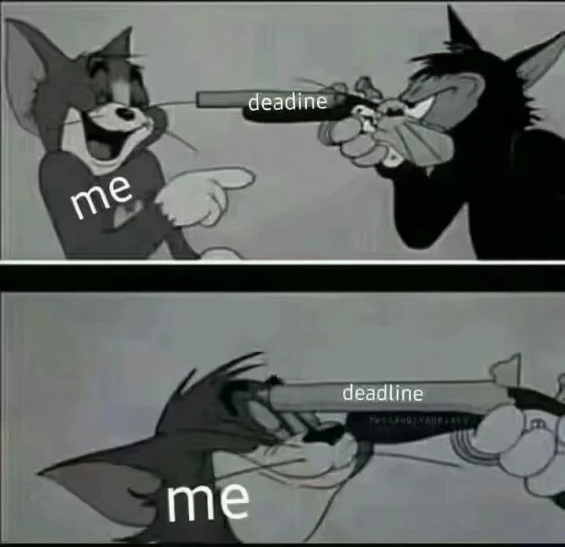

# 失眠與注意力分散

## 前言
近一些天，發現自己不僅失眠而且注意力分散，且無法專注看完一本

 ## 失眠
最近老是失眠，以前的時候是下午睡覺然後在晚上敲敲代碼，編譯系統去看看有什麼 Bug 需要修或者去 pick 別人的代碼，現在完全不行了，彷彿是日夜顛倒，成功過上美國人的生活，但身體和精神狀況卻越來越糟；甚至成了曠課大王，真的是惡夢啊

## 注意力分散
這個問題已經是老生常談，在互聯網下充斥著短視頻和社交媒體，很難集中精力學習。以前我以為是短視頻所以戒掉 Tiktok 之類的短視頻 App 或者關掉其功能；短視頻，使得人們難以擺脫這種短暫的刺激，導致注意力分散和學習效果不佳。言歸正傳，注意力分散實際上就是專注力下滑，如我之前一直在學的 Haskell，我從 YouTube 上面發現了[Learn You A Haskell For Great Good](https://learnyouahaskell.mno2.org/)這本書就開始看了一週時間，大致懂了，但是還是無法解開 exercism 練習題裡麵的第二題；後來，在 Telegram 上面的某個群組裡麵得知學 Haskell 建議去 看 [The Real World Haskell ]（https://rwh.readthedocs.io/en/latest/）；
>- 雖然他說 Rust 寫起來比 Haskell 更好
但是我是主要是想通過學 Haskell 學習 Functional Program，因此還是會選擇 Haskell 作為學習語言。
> - Haskell 確實是很好的學習 Functional Program 的語言，只是 Rust 也有其獨特的優勢。我覺得都可以試試看，根據個人興趣和需求做決定。值得一試的語言，多學習才能拓寬自己的視野。此注釋由 AI 生產出。

不論我用手機還是筆記本看書在都會感覺到困，但是在晚上看手機卻不會，不知道怎麼回事，可能是 OLED 螢幕的問題？

## 反思
最近失眠已經影響到日常的課程和自己的生活作息，所以需要加以調整，不然容易形成不好的習慣；加上自己的注意力分散，學不到什麼東西，只能虛度光陰，現在還在謀求解決方案
