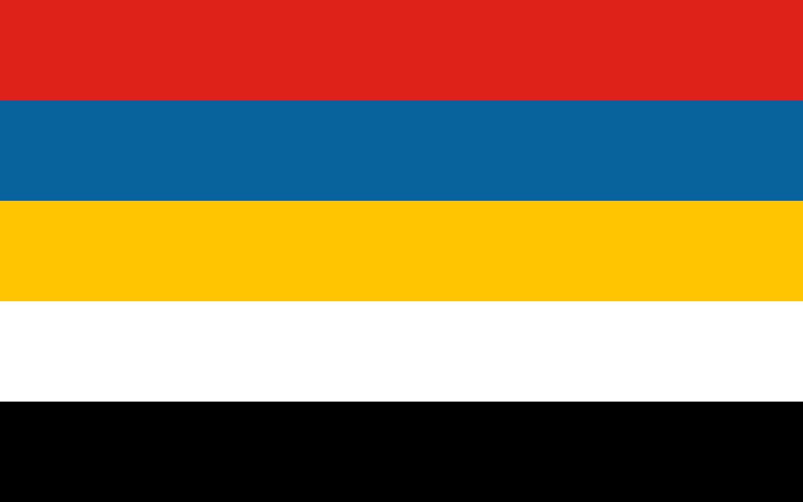

## About me
我是誰？我自己也不知道，我只知道我的靈魂在我的軀體，只知道自己喜歡Android和開源以及ArchLinux，(其他發行版不適合喜歡追求新事物的我，即使ArchLinux讓我滾炸了好幾遍)。還有便是交流歷史，哲學，社會學;馬克思之流就算了，還他的經濟理論停留在19世紀。

## 性取向

最近幾年LGBTQ+很火，剛好可以我的也是彩虹旗

## 三觀
> - 維基百科解釋，三觀即世界觀、人生觀、價值觀的合稱

就單論世界觀，在中國大多數人活在宣傳機器塑造的信息繭房，不知道世界的運行規律，程序員也是，大多數人還在用百度。

人生觀？我現在才20多，自己都活不明白。我怎麼知道？

>- 價值觀（Values）是一種處理事情判斷對錯、做選擇時取捨的標準。有益的事物才有正價值。對有益或有害的事物評判的標準就是一個人的價值觀。不同的價值觀會產生不同的行為模式，進而產生不同的社會文化

個人更傾向於貴族豐富當中的責任感和榮譽感; 還有便是自己有的底線，如不樂衷與檢舉他人，就如一句話所說“小人物也有自己的堅持，小人物也有自己的道德底線;有時候小人的道德底線就成爲了一個時代的道德底線”。還有便是個人不喜歡社會達爾文主義，中國社會的就是內核是社會達爾文主義。
大多數人的的三觀在青少年形成雛形，然後在定於30左右，往後的日子就活在自己的認知當中，作繭自縛，所以人需要不斷學習新的知識和技術

## 個人不好幾點
>- 拖延症，一拖幾天，心血來潮才開始着手幹活
>- 三分鐘熱度，很容易學東西學一下就沒，需要慢慢改變

## 願景
我出身在粵西北的鄉村，從小就與祖父母居住，對家鄉並沒有什麼身份認同感和文化歸屬感，最多就是那邊食物，更多的是對親人的牽掛。我喜歡我有一天就像[燃情歲月](https://zh.wikipedia.org/wiki/%E7%87%83%E6%83%85%E5%B2%81%E6%9C%88)(真愛一世情)裏面的崔斯汀一樣，在廣袤的大草原上放羊打獵，然後跟愛人騎馬散步。
如果有機會我希望我能早日潤走，在不確定的未來，或許離開是最好的選擇

## 結語
我的部落格即博客，主要是分享和記錄一些技術性的內容，還有自己日常的一些生活和感想。

